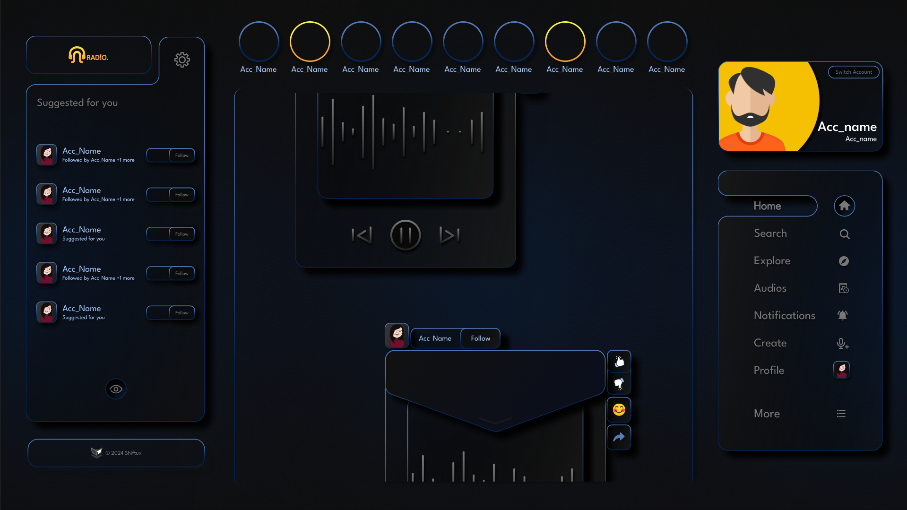
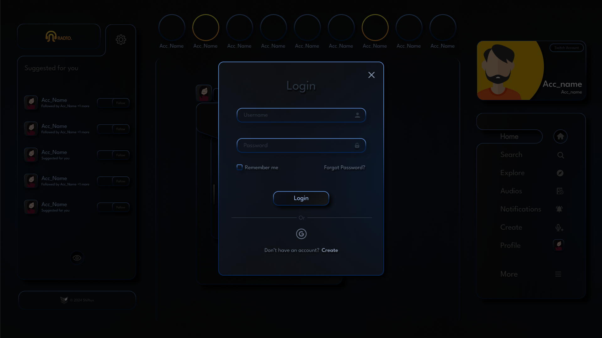

# Radio: Social Audio Platform

Welcome to **Radio**! This platform allows you to post your audio content on a daily basis, helping you reach a broad audience. On Radio, your voice is the focus, eliminating any discrimination based on appearance and allowing people to connect with your message purely through what you speak.

## Features

- **Daily Audio Posts:** Share your thoughts, stories, or any audio content every day.
- **Audience Reach:** Connect with listeners who value your words and ideas.
- **Focus on Voice:** Engage with your audience without the bias of visual appearances.

## Design Prototype

You can check out the **basic design prototype** [here](https://www.figma.com/proto/7r2qOzuliGcML1Ldln1fqK/Radio?page-id=0%3A1&node-id=143-23752&viewport=887%2C201%2C0.05&t=BIPssg6Ak0p5aQ1l-1&scaling=scale-down&starting-point-node-id=143%3A23752&content-scaling=fixed).<br><br>
Meanwhile, here are some pictures of the prototype :- <br><br>
**THE HOME PAGE** <br>
<br><br><br>
THE AUTHENTICATION PART INCLUDES : <br>
- **THE LOGIN POPUP** (Account already exists) <br>
<br><br><br>
- **THE SIGNUP POPUP** (Create new account) <br>
<br><br><br>
**TO CREATE, EDIT AND SHARE AUDIO POSTS : **<br>
<br><br>
<br><br>
<br><br><br>
**THIS PART IS FOR THE AUDIO DMs<**br>
<br><br><br>
## Tech Stack

- **Node.js**: Backend server
- **Next.js**: React framework for building the frontend
- **Firebase Auth**: User authentication
- **MongoDB Atlas**: Database for storing data
- **Jupyter Notebook**: Development environment for AI models
- **Python**: Language for AI development

## Getting Started

### Prerequisites

- Node.js installed on your machine

### Installation

1. Clone the repository:
    ```bash
    git clone https://github.com/yourusername/radio.git
    cd radio
    ```

2. Install the Node.js modules:
    ```bash
    npm install
    ```

3. Build the Next.js project:
    ```bash
    npm run build
    ```

### Running Locally

To start the development server and run the project locally:

```bash
npm run dev
```

Open your browser and navigate to `http://localhost:3000` to see the application in action.

## Contributing

We welcome contributions from the community! If you'd like to contribute, please follow these steps:

1. Fork the repository
2. Create a new branch (`git checkout -b feature-branch`)
3. Make your changes
4. Commit your changes (`git commit -am 'Add new feature'`)
5. Push to the branch (`git push origin feature-branch`)
6. Create a new Pull Request

## Contact

For any questions or feedback, please reach out to us at shiftux.official@gmail.com.

Thank you for using Radio! We hope you enjoy sharing your voice with the world.
